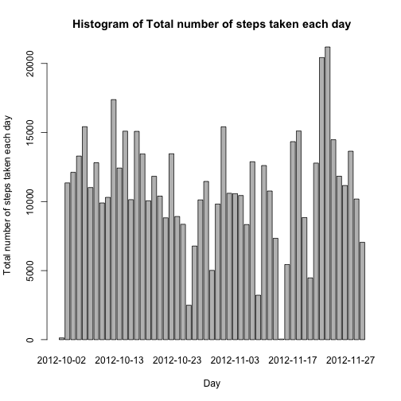
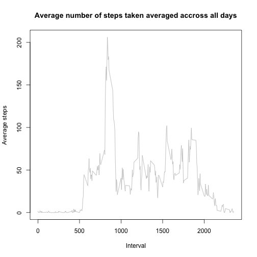
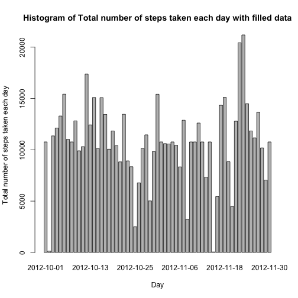

# Reproducible Research: Peer Assessment 1


## Loading and preprocessing the data

```r
activityData = read.csv("activity.csv", colClasses = c("numeric", "Date", "numeric"))
head(activityData)
```

```
##   steps       date interval
## 1    NA 2012-10-01        0
## 2    NA 2012-10-01        5
## 3    NA 2012-10-01       10
## 4    NA 2012-10-01       15
## 5    NA 2012-10-01       20
## 6    NA 2012-10-01       25
```

## What is mean total number of steps taken per day?
Ignore the missing values in the dataset.

```r
completeActivityData = activityData[complete.cases(activityData), ]
```

1 - Histogram of the total number of steps taken each day
  - Calculating the total steps per day

```r
TotalStepsPerDay = aggregate(steps ~ date, data = completeActivityData, sum)
head(TotalStepsPerDay)
```

```
##         date steps
## 1 2012-10-02   126
## 2 2012-10-03 11352
## 3 2012-10-04 12116
## 4 2012-10-05 13294
## 5 2012-10-06 15420
## 6 2012-10-07 11015
```

Plotting the Histogram showing the Total number of steps taken each day

```r
barplot(TotalStepsPerDay$steps, xlab = "Day", ylab = "Total number of steps taken each day", 
    main = "Histogram of Total number of steps taken each day", names.arg = TotalStepsPerDay$date)
```

 

2 - The mean and median total number of steps taken per day

- The mean of the total number of steps taken per day is 

```r
mean(TotalStepsPerDay$steps)
```

```
## [1] 10766
```

- The median of the total number of steps taken per day is 

```r
median(TotalStepsPerDay$steps)
```

```
## [1] 10765
```


## What is the average daily activity pattern?
Calculating the average steps taken accross all days 

```r
avgStepsPerDay = aggregate(steps ~ interval, data = completeActivityData, mean)
```

1 - Ploting the time series plot of the 5-minute interval (x-axis) and the average number of steps taken, averaged across all days (y-axis)


```r
plot(x = avgStepsPerDay$interval, y = avgStepsPerDay$steps, main = "Average number of steps taken averaged accross all days", 
    type = "l", col = "grey", xlab = "Interval", ylab = "Average steps")
```

 


2 - 5-minute interval containing the maximum number of steps

```r
avgStepsPerDay$interval[which.max(avgStepsPerDay$steps)]
```

```
## [1] 835
```


## Imputing missing values
1 - The total number of missing values in the dataset 

```r
length(which(is.na(activityData$steps)))
```

```
## [1] 2304
```


2 - The strategy is to fill in all of the missing values in the dataset with mean value of steps

3 - Creating a new dataset that is equal to the original dataset but with the missing data filled in.

```r
filledActivityData = as.data.frame(activityData)
for (i in 1:length(filledActivityData$interval)) {
    if (is.na(filledActivityData$steps[i])) {
        index = which(avgStepsPerDay$interval == filledActivityData$interval[i])
        meanVal = avgStepsPerDay$steps[index]
        filledActivityData$steps[i] = meanVal
    }
}
```


4 - Histogram of the total number of steps taken each day with filled data

```r
TotalStepsPerDay_filled = aggregate(steps ~ date, data = filledActivityData, 
    sum)
barplot(TotalStepsPerDay_filled$steps, xlab = "Day", ylab = "Total number of steps taken each day", 
    main = "Histogram of Total number of steps taken each day with filled data", 
    names.arg = TotalStepsPerDay_filled$date)
```

 


- The mean of the total number of steps taken per day using filled data is 

```r
mean(TotalStepsPerDay_filled$steps)
```

```
## [1] 10766
```

- The median of the total number of steps taken per day using filled data is 

```r
median(TotalStepsPerDay_filled$steps)
```

```
## [1] 10766
```


## Are there differences in activity patterns between weekdays and weekends?
* Create a new factor variable in the dataset with two levels – “weekday” and “weekend” 

```r
weekday = weekdays(filledActivityData$date)

for (i in 1:length(weekday)) {
    if (weekday[i] == "Sunday" | weekday[i] == "Saturday") {
        weekday[i] = "weekend"
    } else {
        weekday[i] = "weekday"
    }
}
filledActivityData$day = weekday
```


* Calculating the average steps taken accross weekdays and weekends 

```r
# subsetting data to weekday and weekend
weekdayData = subset(filledActivityData, filledActivityData$day == "weekday")
weekendData = subset(filledActivityData, filledActivityData$day == "weekend")


avgStepsPerDayWeekend = aggregate(steps ~ interval, data = weekendData, mean)
avgStepsPerDayWeekday = aggregate(steps ~ interval, data = weekdayData, mean)

```


* Plot containing a time series plot of the 5-minute interval (x-axis) and the average number of steps taken

```r

par(mfrow = c(2, 1))
plot(x = avgStepsPerDayWeekend$interval, y = avgStepsPerDayWeekend$steps, type = "l", 
    xlab = "Interval", ylab = "Average number of steps", main = "Weekend")

plot(x = avgStepsPerDayWeekday$interval, y = avgStepsPerDayWeekday$steps, type = "l", 
    xlab = "Interval", ylab = "Average number of steps", main = "Weekday")
```

 

